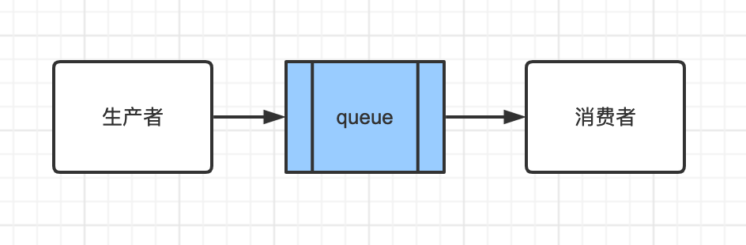
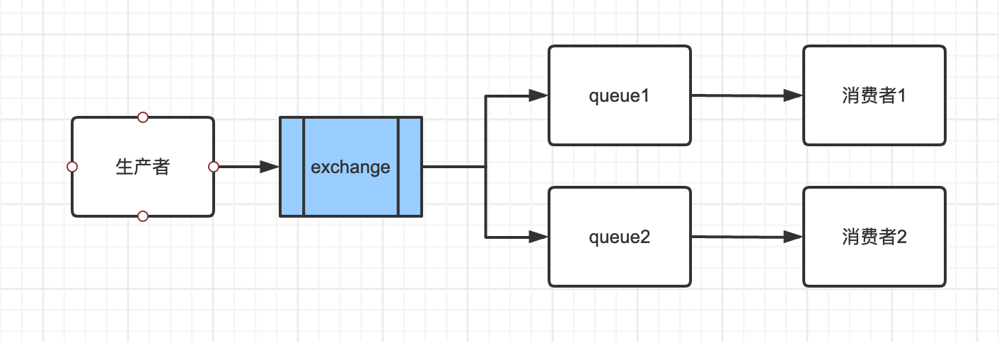
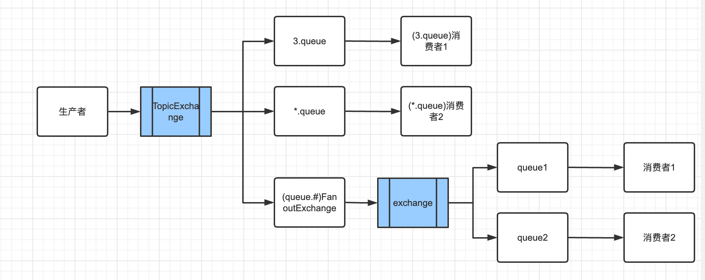

#RabbitMQ概述

- 单机吞吐量：万级，比 RocketMQ、Kafka 低一个数量级
- 时效性：微秒级，这是 RabbitMQ 的一大特点，延迟最低
- 可用性：高，基于主从架构实现高可用（非分布式）
- 消息可靠性：基本不丢

## RabbitMQ高可用性

- 单机模式(Demo):适用于个人测试，尽量不要使用到生产环境
- 普通集群模式（无高可用性）：主要是为了吞吐量，让集群中多个节点来服务某个 queue 的操作
  - 多台机器上启动多个 RabbitMQ 实例，每个机器启动一个
  - queue队列只会放在一个 RabbitMQ 实例上
  - 每个实例都同步 queue 的元数据：通过元数据，可以找到 queue 所在实例
  - 消费的时候，如果连接到了另外一个实例，那么那个实例会从 queue 所在实例上拉取数据
  - 如果queue 所在的实例宕机了，那么会导致其他实例就无法从那个实例拉取数据
  - 如果你开启了消息持久化，等到这个实例恢复了，才可以继续从这个 queue进行数据的拉取
- 镜像集群模式（高可用性）
  - 每个queue，无论元数据还是 queue 里的消息都会存在于多个实例上，每个 RabbitMQ 节点都有这个 queue 的一个完整镜像
  - 每次写消息到 queue 的时候，都会自动把消息同步到多个实例的 queue 上
  - 无法线性的扩展queue
  - queue 的数据量很大，如果大于单机的承载能力，就会无法处理

# 消息模式

### 直连模式(Direct)



代码入口：RabbitMqDirectController.java

### 广播模式(Fanout)

> 简单的讲，就是把交换机（Exchange）里的消息发送给所有绑定该交换机的队列，忽略routingKey

- FanoutExchange模式需要提前将 Exchange 与 Queue 进行绑定，一个 Exchange 可以绑定多个 Queue，一个 Queue 可以同多个 Exchange 进行绑定。是多对多关系
- 不需要 RoutingKey。
- 如果接受到消息的 Exchange 没有与任何 Queue 绑定，则消息会被抛弃。
- 队列的消费者都能拿到消息。实现一条消息被多个消费者消费



 代码位置：RabbitMqFanoutController.java

### 主题模式(TopicExchange)

绑定：

- 定义TopicExchange
- FanoutExchange和TopicExchange进行绑定
- Queue和TopicExchange进行绑定

通配符：

- 路由格式必须以 . 分隔，比如 user.email 或者 user.aaa.email
- 通配符 * ，代表一个占位符，或者说一个单词，比如路由为 user.*，那么 user.email 可以匹配，但是 user.aaa.email 就匹配不了
- 通配符 # ，代表一个或多个占位符，或者说一个或多个单词，比如路由为 user.#，那么 user.email 可以匹配，user.aaa.email 也可以匹配



代码位置：RabbitMqTopicController.java

### 死信模式

- 定义死信交换机
- 死信交换机可以和任何一个普通的队列进行绑定
- 死信队列实际上就是一个普通的队列，只是这个队列跟死信交换机进行了绑定，用来存放死信而已，死信交换机:x-dead-letter-exchange，死信消息路由键:x-dead-letter-routing-key）

代码位置：DeadRabbitMqConfig，RabbitMqDeadController

### 延迟队列

> 首先，它是一种队列，队列意味着内部的元素是有序的，元素出队和入队是有方向性的，元素从一端进入，从另一端取出。

- 定义CustomExchange，x-delayed-type 和 x-delayed-message 固定
- 延迟队列(普通队列)绑定自定义交换器

代码位置：RabbitMqDelayController

# 保障消息投递

- 生产者保障能够发送消息到Broker

  ```java
  spring.rabbitmq.publisher-confirm-type=CORRELATED
  ```

  ```java
      @Bean
      public RabbitTemplate rabbitTemplate(CachingConnectionFactory connectionFactory) {
          RabbitTemplate rabbitTemplate = new RabbitTemplate(connectionFactory);
          //交换器无法根据自身类型和路由键找到一个符合条件的队列时的处理方式
          //true：RabbitMQ会调用Basic.Return命令将消息返回给生产者
          //false：RabbitMQ会把消息直接丢弃
          rabbitTemplate.setMandatory(true);
          rabbitTemplate.setConfirmCallback((correlationData, ack, cause)
                  -> log.info("消息发送成功:correlationData({}),ack({}),cause({})", correlationData, ack, cause));
          rabbitTemplate.setReturnsCallback((message)
                  -> log.info("消息发送失败:exchange({}),route({}),replyCode({}),replyText({}),message:{}",
                  message.getExchange(), message.getRoutingKey(), message.getReplyCode(), message.getReplyText(), message.getMessage()));
          return rabbitTemplate;
      }
  ```

- 消费者消息已经收到(ack)

  ```java
  # 消息开启手动确认ACK
  spring.rabbitmq.listener.direct.acknowledge-mode=manual
  spring.rabbitmq.listener.simple.acknowledge-mode=manual
  ```

- 开启mq消息的持久化

- 生产者发送消息失败，存在处理机制(人工+重试)

- 消费者没有正常的消费的信息，存在处理机制(人工+重试)

- 消费者要进行幂等处理

## Mac 安装 RabbitMQ

```
// 更新brew
brew update
// 安装
brew install rabbitmq
```

brew update 报错：

```
Error:
  homebrew-core is a shallow clone.
To `brew update`, first run:
  git -C /usr/local/Homebrew/Library/Taps/homebrew/homebrew-core fetch --unshallow
This restriction has been made on GitHub's request because updating shallow
clones is an extremely expensive operation due to the tree layout and traffic of
Homebrew/homebrew-core and Homebrew/homebrew-cask. We don't do this for you
automatically to avoid repeatedly performing an expensive unshallow operation in
CI systems (which should instead be fixed to not use shallow clones). Sorry for
the inconvenience!
```

执行命令：

```
git -C /usr/local/Homebrew/Library/Taps/homebrew/homebrew-core fetch --unshallow
```

brew install rabbitmq报错：

```
Error: Your CLT does not support macOS 11.
It is either outdated or was modified.
Please update your CLT or delete it if no updates are available.
Update them from Software Update in System Preferences or run:
  softwareupdate --all --install --force

If that doesn't show you an update run:
  sudo rm -rf /Library/Developer/CommandLineTools
  sudo xcode-select --install

Alternatively, manually download them from:
  https://developer.apple.com/download/more/.

Error: An exception occurred within a child process:
  SystemExit: exit
```

执行命令：

```
sudo rm -rf /Library/Developer/CommandLineTools
sudo xcode-select --install
```

OK。

安装的路径是 `/usr/local/Cellar/rabbitmq/3.8.9_1`，具体情况要视版本而定，我安装的版本是 3.8.3。

接下来就可以启动了，进入安装目录，执行命令：

```js
./sbin/rabbitmq-server
```

接下来可以在浏览器打开 http://localhost:15672，可以看到 RabbitMQ 的管理页面。

默认用户名密码：guest/guest

# 安装延迟队列插件

名称：[rabbitmq-delayed-message-exchange](https://github.com/rabbitmq/rabbitmq-delayed-message-exchange)

地址：https://www.rabbitmq.com/community-plugins.html

这里下载的是[v3.8.9版本](https://github.com/rabbitmq/rabbitmq-delayed-message-exchange/releases/tag/3.8.9)

1. 进入安装目录：/usr/local/Cellar/rabbitmq/3.8.9_1/plugins
2. 复制下载的插件包到安装目录
3. 启动插件./sbin/rabbitmq-plugins enable rabbitmq_delayed_message_exchange
4. 重启rabbitmq：./sbin/rabbitmq-server restart

