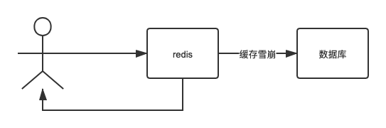

# 缓存雪崩

> 同一时间大量的请求绕过了缓存，直接请求数据库，数据库有可能直接挂掉。



此时就算DBA重启数据库，也会很快被打死。

模拟代码：

```java
package com.redis.advanced.crash;

import com.redis.advanced.service.RedisService;
import lombok.extern.slf4j.Slf4j;
import org.springframework.web.bind.annotation.GetMapping;
import org.springframework.web.bind.annotation.RestController;

import javax.annotation.Resource;

/**
 * 缓存雪崩(简单演示):
 * 三方系统
 * <li>用户A</li>
 * <li>缓存B</li>
 * <li>数据库C</li>
 * <li>简单请求流程：A-->B-->C，此时B突然挂掉，那么所有的请求都到了C，那么C压力突增，也有可能会挂掉</li>
 * @author lizhifu
 * @date 2020/12/8
 */
@RestController
@Slf4j
public class CacheCrashController {
    @Resource
    private RedisService redisService;
    @GetMapping("cacheCrash")
    public String cacheCrash(){
        String cacheCrash = "init";
        try{
            //测试的过程我们可以关闭redis模拟崩溃
            cacheCrash = redisService.getCacheObject("cacheCrash");
            if(cacheCrash == null){
                redisService.setCacheObject("cacheCrash","cacheCrash");
            }
        }catch (Exception e){
            log.error("缓存崩溃");
            //缓存崩溃 去数据库查询
            cacheCrash = "mysql:缓存崩溃了";
        }

        return cacheCrash;
    }
}
```

## 解决方案

思路：

- redis高可用、开启持久化(注意持久化之后，如果重启redis可能会出现数据不一致的情况，因为数据库虽然可能会被打死，但是还是有少部分数据已经成功写入或者更新)
- 使用本地缓存+限流、降级，防止数据库直接被打死

> 推荐使用降级、限流的方式，从根本上保护数据库。